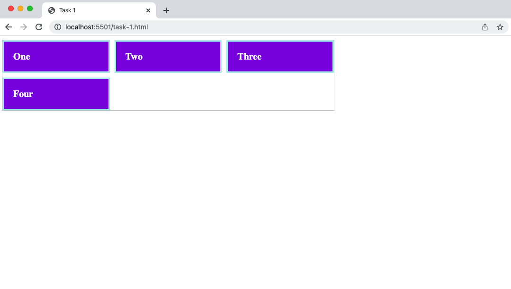
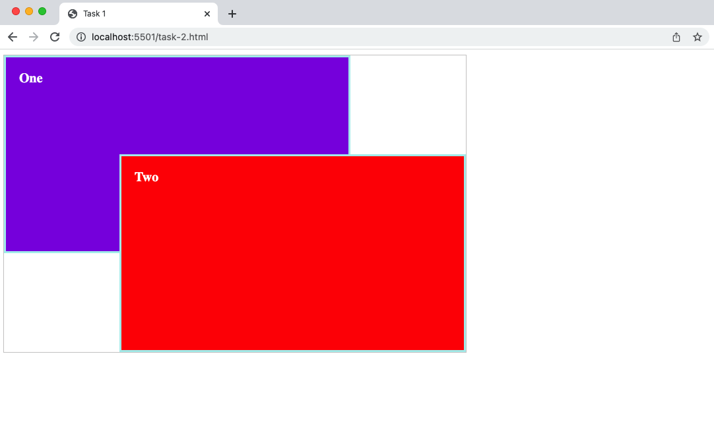
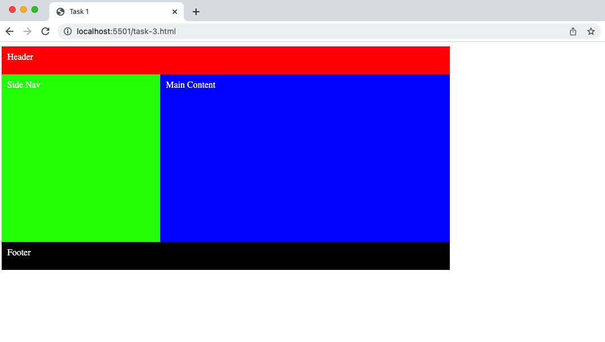

The aim of this skill test is to know how well you understand grid layout

> **Note:** It is very important to type your code and note copy and paste, this way you are building the muscle memory required to become a great developer.

## Task 1

Use grid to layout the divs so that any overflow returns to the next line as shown in the completed example below:

## Task 2

Use grid to overlay one box over the other as shown in the completed example below:

## Task 3

Explore grid areas, update existing code to produce the example below:

